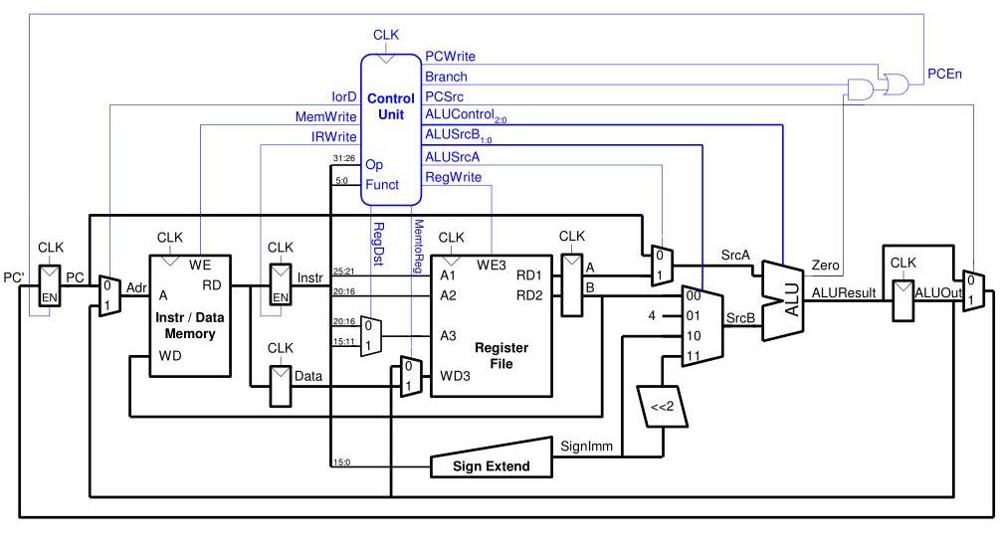

# ChiselProcessor

### TODO 

 - ✅ Add ALU
 - ✅ Add Control Unit
 - ✅ Add Register File
 - ✅ Add Memory
 - ✅ Add Register
 - ✅ Add Register with enable
 - ✅ Add Control Branch
 - ✅ Add Mux
 - ✅ Add Shifter
 - ✅ Add Sign Extension
 - ⭕ Fix overflow
 - ⭕ Fix PCEn
 - ⭕ Test R_TYPE
 - ⭕ Test LW 
 - ⭕ Test SW
 - ⭕ Test BEQ
 - ⭕ Test ADDI
 - ⭕ Test J 
 - ⭕ Test MFC0 

## Data Path

